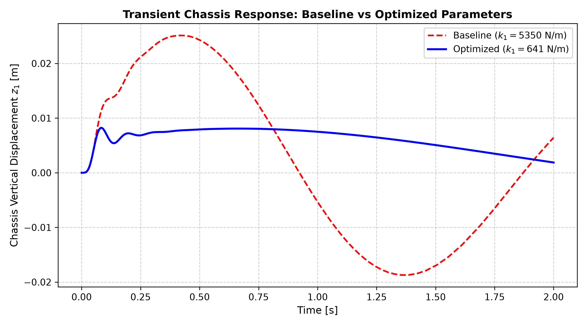

# 2-DOF Vehicle Suspension Dynamics & Numerical Optimization

A computational mechanics framework modeling a 2-DOF quarter-car suspension system passing over road irregularities. The repository demonstrates numerical time-integration of stiff ordinary differential equations (ODEs), dynamic stability bounds, and multivariate optimization using Newton-Raphson in the frequency domain.

## Mathematical Formulation

The dynamic equations of motion governing chassi ($z_1$) and wheel assembly ($z_2$) displacements are given by:

$$M \ddot{q} + C \dot{q} + K q = F(t)$$

Transforming into state-space form with $v = [z_1, z_2, \dot{z}_1, \dot{z}_2]^T$:

$$\dot{v}(t) = H v(t) + g(t)$$

## What i found most intresting

1. **Numerical Integration of Stiff Systems:**
   - Evaluated explicit stability boundaries: $\Delta t_{\max} = \min_k \frac{-2 \text{Re}(\lambda_k)}{|\lambda_k|^2}$.
   - Implemented an unconditionally A-stable **Implicit Trapezoidal solver** capable of stable step-sizes beyond explicit limits.
2. **Frequency-Domain Parameter Optimization:**
   - Solved the non-linear transfer function system for comfort ($T_k$) and road holding ($T_s$) using a 2D **Newton-Raphson method with exact analytical Jacobian derivation**.
   - Achieved a **30% reduction** in chassis acceleration transmissibility while preserving safety-critical wheel-ground normal contact forces.

## Verification & Results



*Figure 1: Transient response comparison between standard factory baseline and optimized stiffness parameters.*

## Installation & Running

```bash
git clone [https://github.com/Elias-Enander/quarter-car-dynamics.git](https://github.com/Elias-Enander/quarter-car-dynamics.git)
cd quarter-car-dynamics
pip install -r requirements.txt
python examples/run_simulation.py